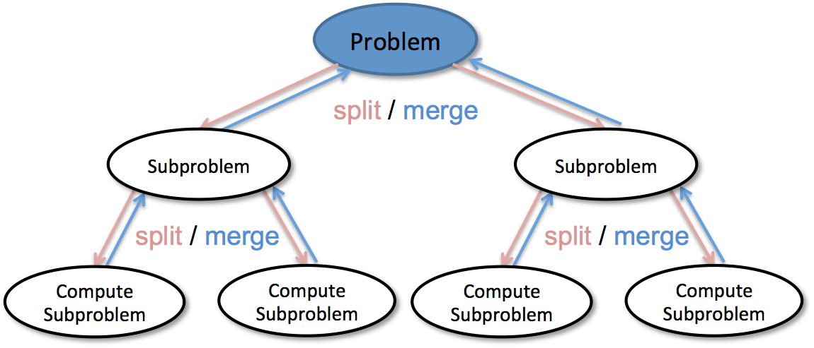

  <h1>ETAPA 01</h1>
    
  

  

    “ADICIONAR FRASE!!!!!!!!!!!"
  

## 📝 Muitas palavras não indicam necessariamente muita sabedoria.

Durante a aula de história, foi passado um trabalho para discutir grandes invenções e descobertas da humanidade. Para isso, o professor passou um livro com mais de 1000 exemplos e pediu para que os alunos escolhessem alguns casos e entregassem em forma de resumo.  
Jaime Barbosa, que também é aluno de programação e, por consequência, obcecado em encontrar formas otimizar suas tarefas - o que muitas vezes sai do seu controle - decidiu por em prática seus conhecimentos para entregar seu trabalho de uma forma mais eficiente.

## ❔ QUESTÕES

### 1️⃣ [Na dúvida, resuma.](questao1/descricao.md)

---

### 2️⃣ [Onde não há normas, a ordem se perde.](questao2/descricao.md)

---

### 3️⃣ [Dividir para conquistar.](questao3/descricao.md)

---