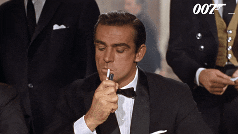

  <h1>ETAPA 02</h1>
    
  

## 📝 O nome é Bond, James Bond.

A saga do nosso estudante Jaime Barbosa e suas aulas de história continua. Após concluir seu trabalho dos resumos, Jaime tomou gosto pela história e continuou estudando.

Acontece que desde muito criança, Jaime sempre foi muito fã de filmes de espionagem. Assim, quando se deparou com a figura de Júlio César nos livros e viu que havia um tipo de cifra que levava seu nome, a chama de programador e seu espírito de espião reacenderam.

## ❔ QUESTÕES

### 1️⃣ [Até tu, Bruto?](questao1/descricao.md)

---

### 2️⃣ [Eu te ensinei tudo o que você sabe, mas não tudo o que eu sei.](questao2/descricao.md)

---

### 3️⃣ [Se não pode vencê-los, junte-se a eles.](questao3/descricao.md)

---