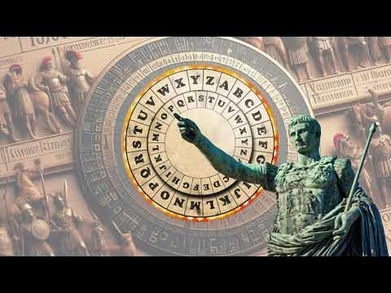

  <h1>QUESTÃO 01</h1>
    
  

## 📝 Até tu, Bruto?

Jaime decidiu implementar um programa que cifra e decifra mensagens - com o padrão da cifra de Cesár. Seu objetivo é trocar mensagens confidenciais em sala com seus amigos sem que o professor saiba o conteúdo das mensagens mesmo flagrando a troca.

**Funcionamento da cifra de César:**

>Substituição de Letras: Cada letra no texto original  é substituída por outra letra que está um número fixo de posições à frente no alfabeto. Por exemplo, com uma **rotação de 3**:
- A → D
- B → E
- Z → C

>No exemplo atual, dígitos também serão codificados. Seguindo a demonstração com uma **rotação de 3**:
- 0 → 3
- 4 → 7
- 8 → 1

**Exemplos:**

>- **Cifrando com rotação 2:**
>   - ORIGINAL:  ABc 08
>   - CIFRADO: CDe 20
>- **Decifrando com rotação 4:**
>   - ORIGINAL:  EFg 42
>   - DECIFRADO: ABc 08

## 🛠️ SUA TAREFA

Você receberá um primeiro input representado o número `n` de testes que serão executados, e 3 inputs posteriores - repetidos `n` vezes - representando `frase`, `rotacao` e `operacao`.

Para cada teste execute a operação pedida sobre a frase, levando em conta o número de rotação especificado.

>**Dica: Implemente uma função nos moldes abaixo**
>- cifra_de_cesar(frase, rotacao, operacao)
>  - **frase**: texto a ser convertido;
>  - **rotacao**: numero de rotacoes;
>  - **operacao**: cifrar ou decifrar.

>**OBS:** Somente caracteres alfanuméricos devem ser cifrados e decifrados. Também é garantido que não haverá acentos nas palavras.

>**OBS:** Letras maiúsculas devem permanecer maiúsculas e letras minúsculas devem permanecer minúsculas após serem cifradas ou decifradas.

---

## 👀 DEMONSTRAÇÃO

**Considerando os exemplos de primeiro parágrafo acima, assuma - para os testes abaixo - que conteúdo da variável `texto` corresponde ao primeiro e segundo exemplo, respectivamente.**
<table>

<thead>
    <tr>
        <th>Input</th>
        <th>Result</th>
    </tr>
</thead>

<tbody>
    <!-- Primeiro Teste -->
    <tr>
        <!-- Inputs -->
        <td><pre>3
Julio Cesar nasceu em 100 a.C.
3
cifrar
Hjxfw rtwwjz htr 00 fstx!
5
decifrar
Julio Cesar nunca foi imperador.
0
cifrar
        </pre></td>
        <!-- Outputs -->
        <td><pre>Mxolr Fhvdu qdvfhx hp 433 d.F.
Cesar morreu com 55 anos!
Julio Cesar nunca foi imperador.
        </pre></td>
    </tr>
</tbody>

</table>

---
