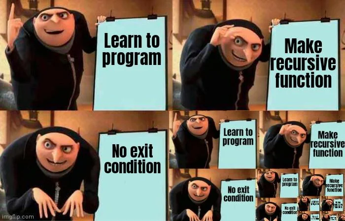

  <h1>QUESTÃO 02</h1>
    
  

## 📝 Para entender a recursão, primeiro é preciso entender a recursão.

Mesmo após ordenar as suas atividades, Jaime não está dando conta de encontrá-las e resolvê-las a tempo. 

Pensando no porque disso estar acontecendo, ele concluiu que, apesar de sua lista de atividades inicial estar ordenada, as novas atividades que os professores passavam não estavam seguindo o padrão da ordenação - pois eram jogadas de qualque jeito na pasta de tarefas.

Contudo, de vez em quando a sorte aparece para todos, até para os universitários. Jaime acabou de aprender o conceito de recursão em suas aulas de APC e decidiu implementar uma inserção binária para encontrar em qual posição deve adicionar suas novas atividades.

## 🛠️ SUA TAREFA

Implemente a função **recursiva** `encontrar_posicao()`. Ela receberá como argumentos:

1. Uma lista unidimensional de atividades ordenadas alfabeticamente;
2. Uma string que representa a nova atividade a ser inserida na lista;

A função deve retornar a posição em que o novo item deve ser incluído na lista.

---

## 👀 DEMONSTRAÇÃO

Para simplificar a visualização da demonstração, a função `encontrar_posicao(atividades, "nova atividade")`, usará a variável **atividades** para representar a lista de atividades passada como argumento.

**Conteúdo de `atividades` nos exemplos abaixo:

    atividades = [
      "Atividade de Matrizes",
      "Competicao de Programacao",
      "Experimento de Aceleracao",
      "Experimento de Velocidade",
      "Lista de Equacoes Diferenciais",
      "Pratica de Listas",
      "Prova Final",
      "Trabalho de EDOs"
    ]

<table>

<thead>
    <tr>
        <th>Input</th>
        <th>Result</th>
    </tr>
</thead>

<tbody>
    <!-- Primeiro Teste -->
    <tr>
        <!-- Inputs -->
        <td><pre>
encontrar_posicao(atividades, "Aferimento do Experimento de Velocidade")
        </pre></td>
        <!-- Outputs -->
        <td><pre>
0
        </pre></td>
    </tr>
    <!-- Segundo Teste -->
    <tr>
        <!-- Inputs -->
        <td><pre>
encontrar_posicao(atividades, "Simulado de Integrais Triplas")
        </pre></td>
        <!-- Outputs -->
        <td><pre>
7
        </pre></td>
    </tr>
    <!-- Terceiro Teste -->
    <tr>
        <!-- Inputs -->
        <td><pre>
encontrar_posicao(atividades, "Tutorial de Recursao")
        </pre></td>
        <!-- Outputs -->
        <td><pre>
8
        </pre></td>
    </tr>
</tbody>

</table>

---
