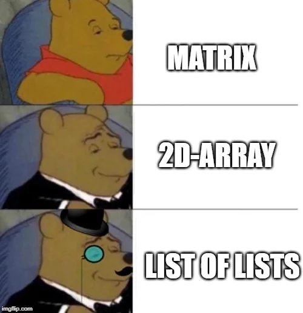

  <h1>QUESTÃO 01</h1>
    
  

## 📝 Quem não guarda, perde.

Exercício com foco em montar listas multidimensionais e heterogêneas

## 🛠️ SUA TAREFA

Tarefa

---

## 👀 DEMONSTRAÇÃO

<table>

<thead>
    <tr>
        <th>Input</th>
        <th>Result</th>
    </tr>
</thead>

<tbody>
    <!-- Primeiro Teste -->
    <tr>
        <!-- Inputs -->
        <td><pre>
valor do input
        </pre></td>
        <!-- Outputs -->
        <td><pre>
valor do output
        </pre></td>
    </tr>
</tbody>

</table>

---
